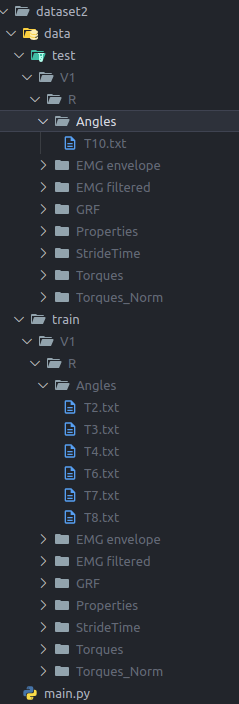
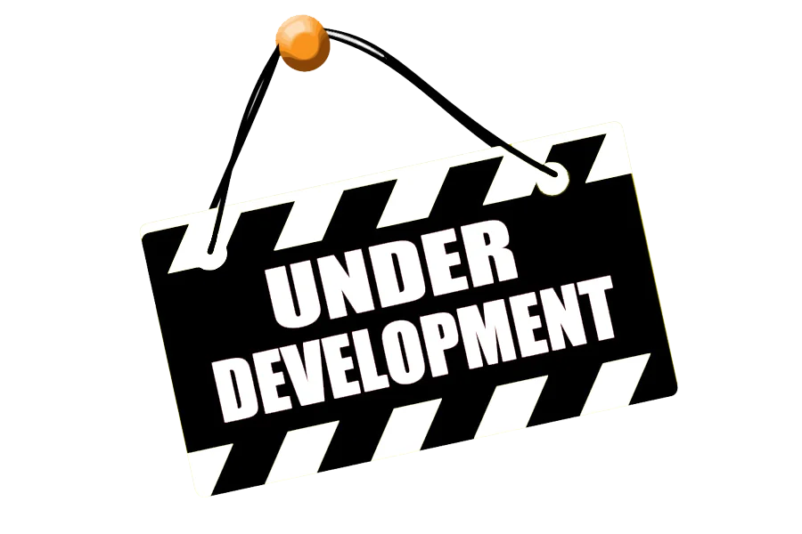

# Prediction of Gait Parameters For Lower Limb Prostheses with Volitional Control

<p align="center">
  
</p>

## Overview
This repository contains code for analyzing Electromyography (EMG) signals and other motion sensors to predict gait parameters to apply to the control of lower limb prostheses. The project includes several processing and machine learning techniques to filter and extract meaningful features from the signals, and then use these features to predict gait parameters.

## Table of Contents
- [Installation](#installation)
- [Data Description](#data-description)
- [Usage](#usage)
  - [Main Program](#main-program)
  - [Additional Scripts](#additional-scripts)
- [Results](#results)
- [Contributing](#contributing)
- [Thanks](#thanks)

## Installation
1. Clone this repository:
    ```sh
    git clone https://github.com/intel-comp-saude-ufes/2024-1-P1-prediction-of-gait-parameters-for-lower-limb-prostheses-with-volitional-control
    cd 2024-1-P1-prediction-of-gait-parameters-for-lower-limb-prostheses-with-volitional-control
    ```
2. Install the required Python packages:
    ```sh
    pip install -r requirements.txt
    ```

## Data Description
<p align="center">
  
</p>

The data used in this project consists of X, Y and Z. The dataset includes the following files:
- `data/example.csv`: example signal collected during X seconds, by Yhz.
- `data/...`: ...

## Usage
### Main Program
The main program trains a X,Y and Z models to predict X, Y and Z gait parameters based on EMG, X, Y and Z sensors data. To run the main program, use the following command:
```sh 
python main.py
```

### Additional Scripts
The `scripts/` directory contains additional scripts to preprocess the data, train the models, and evaluate the results. To run a script, use the following command:
```sh
python scripts/script_name.py
```

## Results
The main program trains a X, Y and Z models to predict X, Y and Z gait parameters based on EMG, X, Y and Z sensors data. The evaluation of the models is performed using a X-fold cross-validation and using the following metrics:
- Mean Absolute Error (MAE)
- Mean Squared Error (MSE)
- Root Mean Squared Error (RMSE)
- Mean Absolute Percentage Error (MAPE)
- R2 Score

The results of the project are summarized in the following figure:
<p align="center">
  
</p>

> A video sumarizing the hole project can be found [here](https://www.youtube.com/watch?v=dQw4w9WgXcQ).

## Contributing
Contributions are what make the open-source community such an amazing place to learn, inspire, and create. Any contributions you make are **greatly appreciated**.

1. Fork the Project
2. Create your Feature Branch (`git checkout -b feature/AmazingFeature`)
3. Commit your Changes (`git commit -m 'Add some AmazingFeature'`)
4. Push to the Branch (`git push origin feature/AmazingFeature`)
5. Open a Pull Request

## Thanks
Special thanks to the [Andre Georghton Cardoso Pacheco](https://github.com/paaatcha) for giving the opportunity to make this project happen.