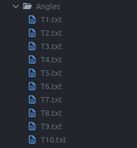
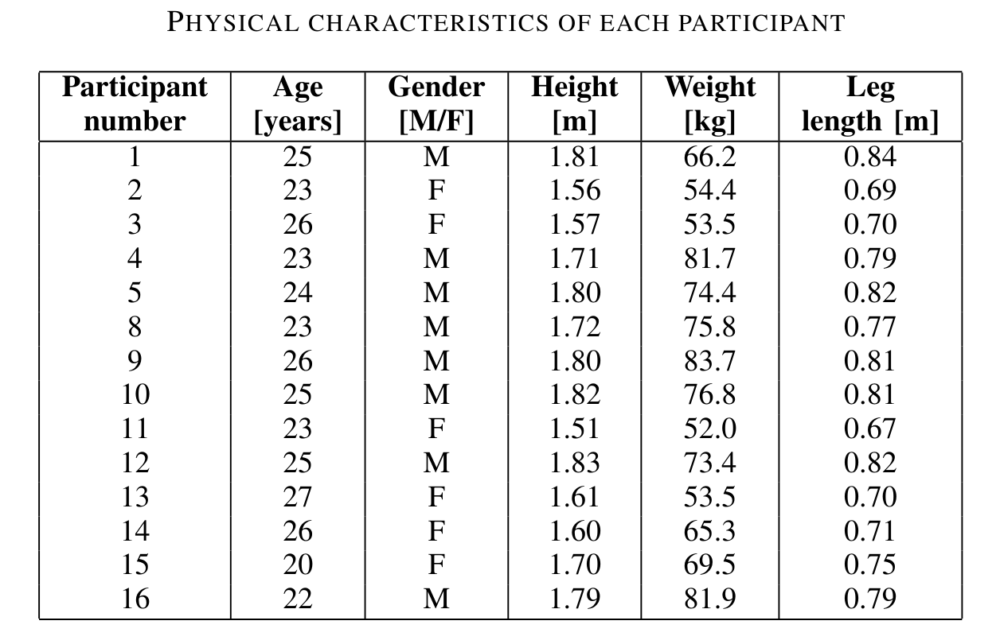
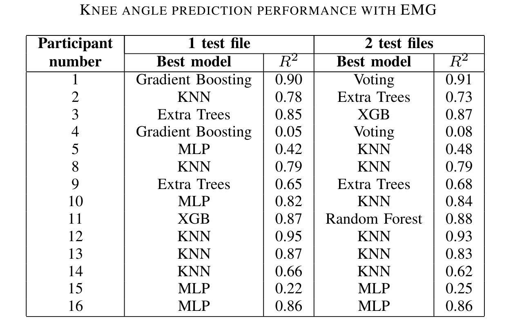
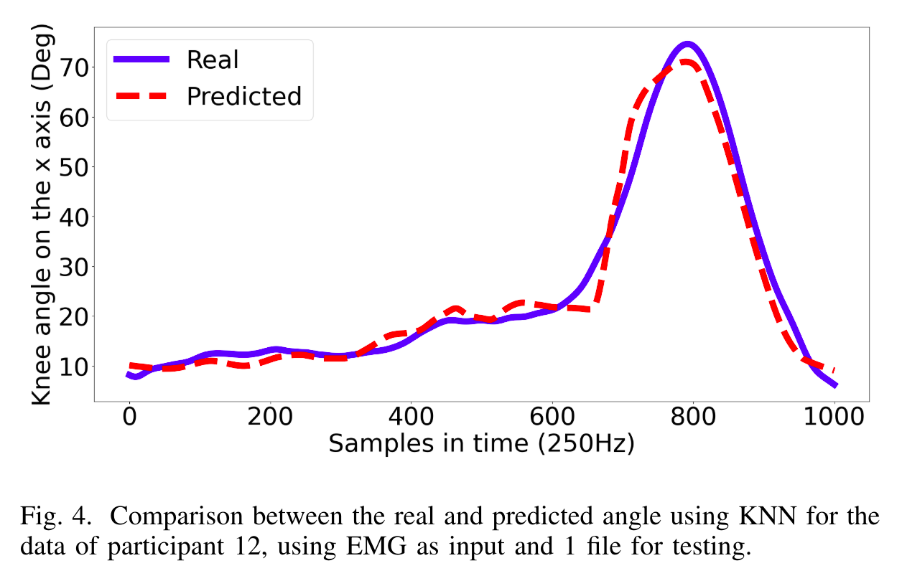
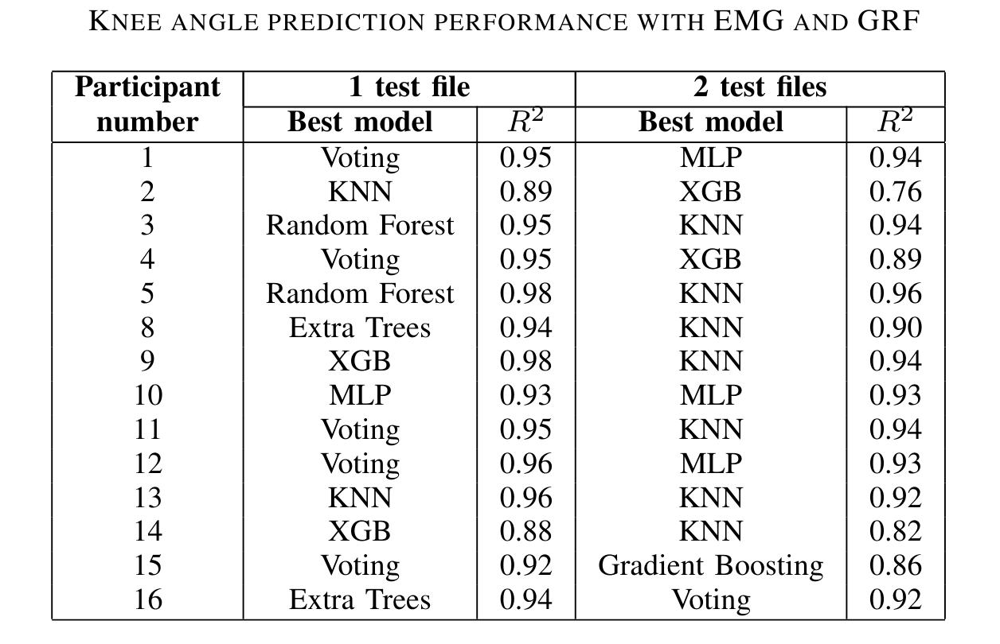
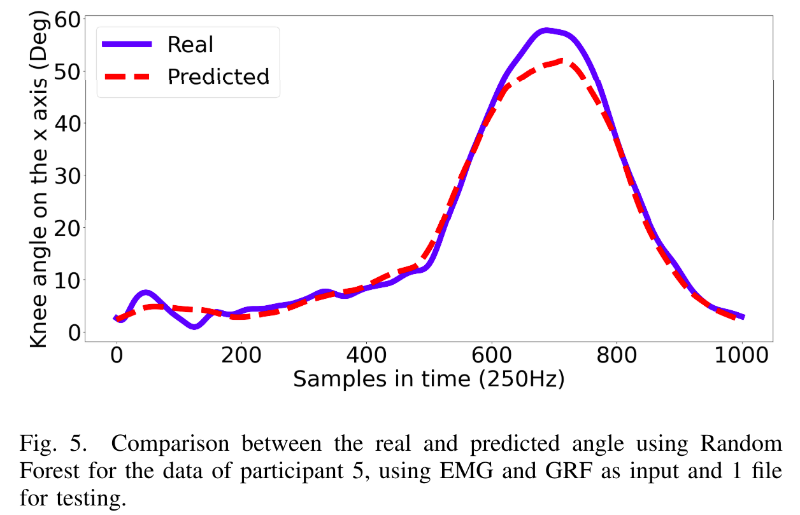
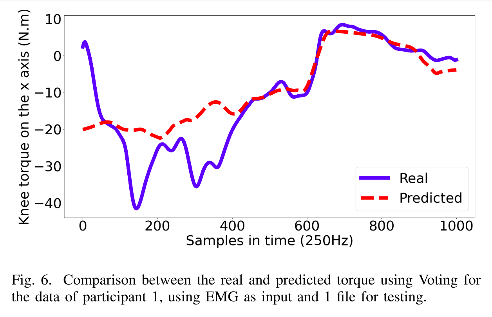
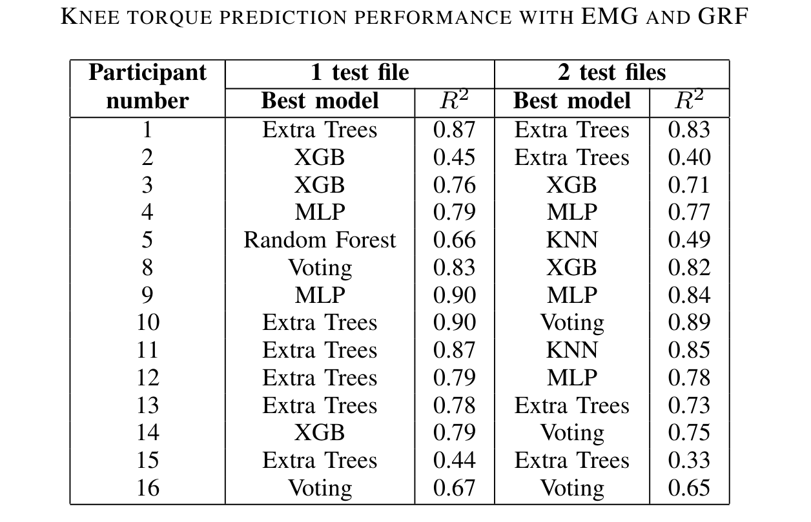
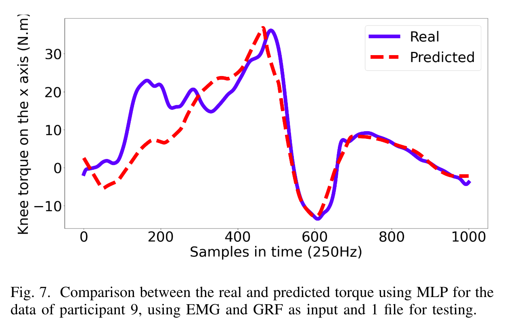

# Prediction of Gait Parameters For Lower Limb Prostheses with Volitional Control

## Overview
This repository contains code for analyzing Electromyography (EMG) signals and other motion sensors to predict gait parameters to apply to the control of lower limb prostheses. The project includes several processing and machine learning techniques to filter and extract meaningful features from the signals, and then use these features to predict gait parameters.

<p align="center">
  
</p>


## Table of Contents
- [Installation](#installation)
- [Data Description](#data-description)
- [Usage](#usage)
  - [Main Program](#main-program)
  - [Additional Scripts](#additional-scripts)
- [Results](#results)
- [Contributing](#contributing)
- [Thanks](#thanks)

## Installation
1. Clone this repository:
    ```sh
    git clone https://github.com/intel-comp-saude-ufes/2024-1-P1-prediction-of-gait-parameters-for-lower-limb-prostheses-with-volitional-control
    cd 2024-1-P1-prediction-of-gait-parameters-for-lower-limb-prostheses-with-volitional-control
    ```
2. Install the required Python packages:
    ```sh
    pip install -r requirements.txt
    ```

## Data Description
<p align="center" style="display: flex; align-items: center; justify-content: center;">
  
  
</p>
<p align="center" style="display: flex; align-items: center; justify-content: center;">
  
  
</p>

The data used in this project consists of the folders _Angles_, _EMG envelope_, _GRF_ and _Torques_, each containing 10 recordings of a 10 meter walk (_T1.txt_ ~ _T10.txt_, in which each of these files can be seen as a gait cycle). A brief explanation of each data is given below:
- `Angles`: Angle of the pelvis, hip, knee and ankle, in all axes
- `EMG Envelope`: Enveloped EMG signal from the vastus lateralis, biceps femoris, tibialis anterior and lateral gastrocnemius muscles
- `GRF`: Ground reaction forces in all axes
- `Torques`: Torque of the pelvis, hip, knee and ankle, in all axes

Also is a file for each participant:
- `Metadata.txt`: Describe some physical characteristics of the participant

These physical characteristics of each participant are summarized in the following table:
<p align="center" style="display: flex; align-items: center; justify-content: center;">
  
</p>

## Usage
### Main Program
You can adjust the main program to train whatever model you want using any inputs and outputs. To run the main program, use the following command:
```sh 
python main.py
```

### Additional Scripts
The `cross_val_files` and `cross_val_participants` scripts processes the data dynamically. You can choose how many files between _T1.txt_ ~ _T10.txt_ (or participantes between _P1_ ~ _P16_) you want to use as test and it will cross-validate, generating an average of the metrics at the end. This preserves the temporal relationship between data, which is important for the model to learn the gait cycle. To run the scripts, use the following command:
```sh
python cross_val_files.py
```
```sh
python cross_val_participants.py
```

## Results
In this section, the performance of each of the presented models was evaluated when subjected to different types of input and output data, as well as the changes observed during the variations of the testing processes. These results can be seen in Tables below. The performance metric used to compare the models was $R^2$, and in the event of a tie, the model with the lowest mean absolute error was adopted.

The results of the project are summarized in the following figures, where the graph on the right is the comparison between the value predicted by the model with the best result (highest $R^2$) obtained in the table on the left, with the actual value of the output:
<p align="center" style="display: flex; align-items: center; justify-content: center;">
  
  
</p>
<p align="center" style="display: flex; align-items: center; justify-content: center;">
  
  
</p>
<p align="center" style="display: flex; align-items: center; justify-content: center;">
  
  
</p>
<p align="center" style="display: flex; align-items: center; justify-content: center;">
  
  
</p>

> A video sumarizing the hole project can be found [here](https://youtu.be/2M8TBRW4D_8).

> The full article about this project can be found [here](media/under-development.png).

## Contributing
Contributions are what make the open-source community such an amazing place to learn, inspire, and create. Any contributions you make are **greatly appreciated**.

1. Fork the Project
2. Create your Feature Branch (`git checkout -b feature/AmazingFeature`)
3. Commit your Changes (`git commit -m 'Add some AmazingFeature'`)
4. Push to the Branch (`git push origin feature/AmazingFeature`)
5. Open a Pull Request

## Thanks
Special thanks to the [Andre Georghton Cardoso Pacheco](https://github.com/paaatcha) for giving the opportunity to make this project happen.